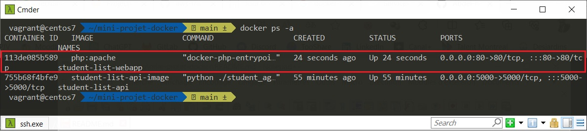
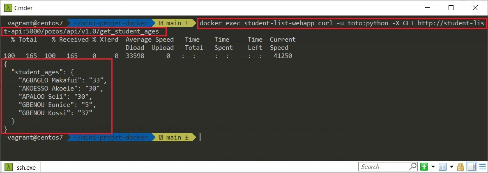
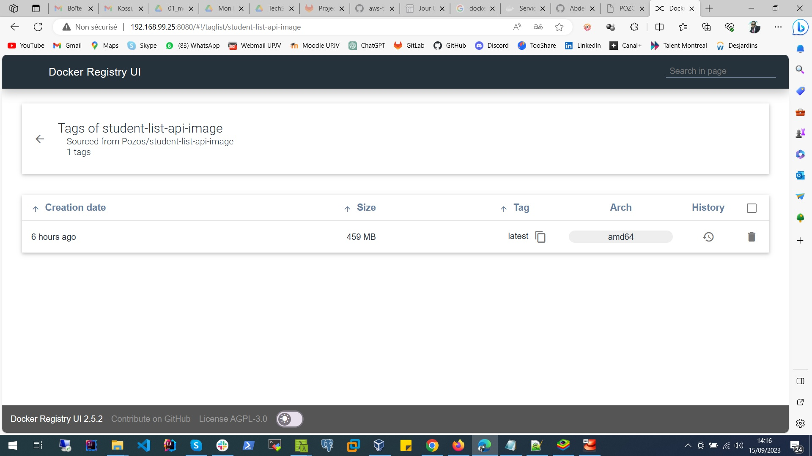

# mini-projet-docker : Project based on student-list project

# Information about the owner

Session           : Bootcamp DevOps N°15

Period            : September - November

First & Last Name : Kossi GBENOU

LinkedIn          : https://www.linkedin.com/in/gkossi/


# Summary

*As part of this project, whose specifications can be found [here](https://github.com/diranetafen/student-list.git "here"), I was asked to help POZOS deploy its ***student-list*** application with maximum automation by setting up an insfrastructure based on Docker technology.

The application to deploy has two modules :

- *The first module is a REST API (with basic authentication needed) who send the desire list of the student based on JSON file
- *The second module is a web app written in HTML + PHP who enable end-user to get a list of students

!["Crédit image : https://github.com/diranetafen"] 

------------

## The need

My job is to :
1) Use Virtualbox as a hypervisor for the virtual machine creation
2) Use Vagrant as infrastructure provisioner to manage the VM
3) Install Docker and Docker-compose on the VM 
4) Build one container for each module (Backend & Fronted)
5) Make the containers interact with each other
6) Provide a private registry


## My work plan

Here's my plan for this project:

Firstly, I'm setting up my infrastructure from the code to be driven with the Vagrant tool (***Vagrantfile*** and ***install_docker-centos***). This will be a VM running the Centos7 OS with Docker and Docker-compose.

Secondly, I'm going to do the build and make the necessary tests. This stage will involve several actions on my part.

Then, as soon as the tests are correct, I proceed with the deployment
-----------------------

First, let me introduce you the six ***files*** of this project and their role 

Then, I'll show you how I ***built*** and tested the architecture to justify my choices

Third and last part will be about to provide the ***deployment*** process I suggest for this application.


### The files and their role

My delivery contain five main files : ***Vagrantfile***, ***install_docker-centos.sh***, ***Dockerfile***, ***docker-compose.yml*** and ***private-registry.yml***

- Vagrantfile: this file contains all the parameters used to create the virtual machine
- install_docker-centos.sh: this file contains the Docker and Docker-compose installation script
- docker-compose.yml: to launch the application (API and web app)
- private-registry.yml: to launch the local registry and its frontend
- simple_api/student_age.py: contains the source code of the API in python
- simple_api/Dockerfile: to build the API image with the source code in it
- simple_api/student_age.json: contains student name with age on JSON format
- index.php: PHP  page where end-user will be connected to interact with the service to list students with their age.


### BUILDING IMAGE AND TESTING STEP BY STEP

To make the job correctly, you have to follow these steps :

NB : I consider that you have already cloned the [project](https://github.com/diranetafen/student-list.git "project")


## Step N°1 : Building images

1) Enter the API directory and build it's container image :

```bash
#Enter the directory
cd ./mini-projet-docker/simple_api

#Buil the image
docker build -t student-list-api-image .

#Verify that the image is built and present localy
docker images
```
> ![1-docker images] 


## Step N°2 : Creating a bridge-type network

2) Create a bridge-type network to enable the two containers to interact using their names, based on the dns functionality :

```bash
#Create the network
docker network create --driver=bridge student-list-network

#Verify the network
docker network ls
```
> ![2-docker network ls] 


## Step N°3 : Runing the Backend API container

3) Move back to the root directory of the project and run the backend api container with those arguments :

```bash
#Move back to the root directory of the project
cd ..

#Run the backend api container
docker run --rm -d --name=student-list-api -p 5000:5000 --network=student-list-network -v ./simple_api/:/data/ student-list-api-image

#Verify the container
docker ps
```
> ![3-docker ps] 


I had to mount the `./simple_api/` local directory in the `/data/` internal container directory so the api can use the `student_age.json` list 

> ![4-./simple_api/:/data/] 


## Step N°4 : UPDATING INDEX FILE

4) Update the `index.php` file :

You need to update the following line before running the website container to make ***api_ip_or_name*** and ***port*** fit your deployment
   ` $url = 'http://<api_ip_or_name:port>/pozos/api/v1.0/get_student_ages';`

```bash
sed -i 's/<api_ip_or_name:port>/student-list-api:5000/g' ./website/index.php
```
> ![5-student-list-api:5000] 


## Step N°5 : Runing le Fronted webapp container

5) Run the frontend webapp container with the username (toto) and password (python) provided in the source code `.simple_api/student_age.py`

```bash
#Run the backend api container
docker run --rm -d --name=student-list-webapp -p 80:80 --network=student-list-network -v ./website/:/var/www/html -e USERNAME=toto -e PASSWORD=python php:apache

#Verify the container
docker ps
```
> ![7-docker ps] 


## Step N°6 : Testing

6) Test the api through the frontend :

6a) Using command line :

The next command will ask the frontend container to request the backend api and show you the output back.
The goal is to test both if the api works and if frontend can get the student list from it.

```bash
docker exec student-list-webapp curl -u toto:python -X GET http://student-list-api:5000/pozos/api/v1.0/get_student_ages
```
> ![8-docker exec] 


6b) Using a web browser `IP:80` :

- Firstly, i'm running the app into a virtual machine. So that, i'll find my VM ip address by typing `ip a` and localise the interface named ``
```bash
#Find th VM ip address
ip a
```
> ![9-ip a] 

- Then, i'll open the browser and type `192.168.99.25:80` in the navigation erea and click on the `List Student` button

> ![10-check webpage] 


## Step N°7 :

7) Clean the workspace :

Thanks to the `--rm` argument we used while starting our containers, they will be removed as they stop.
Remove the network previously created.


```bash
docker stop student-list-api
docker stop student-list-webapp
docker network rm student-list-network
docker network ls
docker ps -a
```
> ![11-clean-up] 


## DEPLOYEMENT

As the tests passed i can now 'composerize' the infrastructure by putting the `docker run` parameters into a `docker-compose.yml` code.

1) Run the application (api + webapp) :

As i've already created the application image, now i just have to run :

```bash
#Move back to the project root directory
cd mini-projet-docker/

#Run docker-compose
docker-compose up -d
```
> ![12-docker-compose up -d] 

Docker-compose permits to chose which container must start first.
The api container will be first as I specified that the webapp `depends_on:` it.
> ![13-depends on] 

And the application works :
> ![14-check app] 


2) Create a registry and its frontend

I used `registry:2` image for the registry, and `joxit/docker-registry-ui:static` for its frontend gui and passed some environment variables :

> ![15-gui registry env var] 


E.g we'll be able to delete images from the registry via the gui.

```bash
docker-compose -f private-registry.yml up -d
```
> ![16-creating private registry] 

> ![17-checking private registry gui] 


3) Push an image on the registry and test the gui

You have to rename it before (`:latest` is optional) :

```bash
#Verify the images list and copy the id
docker images

#Change the image tag by using the id
docker tag d2abc48681c0 localhost:8080/student-list-api-image

#Verify the image list for matching the tag
docker images

#Login into the private registry
docker login -u pozos -p pozos http://localhost:8080/

#Push the image
docker push localhost:8080/student-list-api-image
```


>  

> ![19-Verify image on the registry] 

> ![20-Image detail on the registry] 


------------


# CONCLUSION.

My experience was rewarding because through this project I had the opportunity to create a custom Docker image, configure networks and volumes, and deploy containers using docker-compose. This has enabled me to strengthen my technical skills and gain a better understanding of the principles of microservices. I look forward to tackling similar projects with any company in the future and helping to improve the containerisation and deployment processes for them.

> ![GBENOU Kossi on Linkedin => https://www.linkedin.com/in/gkossi/]
> ![21-My Profile on Linkedin] 